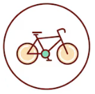
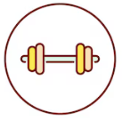

    

  <h3 align="center">🏋️‍♂️ Assistente de Personal Trainer - Gerador de Treino Ideal</h3>
Este projeto é um desafio de Prompt Engineer, onde o objetivo é criar um prompt que ajuda a montar o treino ideal para cada combinação de fatores, como biotipo corporal, disponibilidade de tempo e tipo de exercícios preferidos e objetivo final dos treinos. O assistente de personal trainer gerado por esse prompt será capaz de personalizar os treinos de acordo com as características e necessidades do usuário.
O projeto deve ser feito utilizando as boas práticas de prompt engineer.

## 📋 Índice

- [📋 Índice](#-índice)
- [📝 Introdução](#-introdução)
- [💪 Biotipos Corporais](#-biotipos-corporais)
- [📅 Dias Disponíveis para Treino](#-dias-disponíveis-para-treino)
- [🏋️ Tipos de Exercícios](#️-tipos-de-exercícios)
- [🏋️ Objetivo dos Exercícios](#️-objetivo-dos-exercícios)
- [🛠️ Regras de negócio](#️-regras-de-negócio)
- [📖 Material de Apoio](#-material-de-apoio)
- [🎯 Prompt de Resposta Proposto](#-prompt-de-resposta-proposto)

---

## 📝 Introdução

Este projeto visa criar um assistente de personal trainer automatizado que ajuda a gerar treinos personalizados. O usuário fornecerá informações como o biotipo corporal, a quantidade de dias disponíveis para treinar na semana, tipo de exercício preferido e objetivo final dos treinos, e o assistente gerará um plano de treino ideal com base nessas informações.

---

## 💪 Biotipos Corporais

A primeira regra para personalizar o treino é determinar o biotipo corporal do usuário. Existem três biotipos principais:

<table>
  <tr>
    <th>Imagem</th>
    <th>Biotipo</th>
    <th>Descrição</th>
  </tr>
  <tr>
    <td style="text-align: center;">
      
    </td>
    <td><strong>Ectomorfo</strong></td>
    <td>Corpo mais magro, difícil ganhar peso e massa muscular.</td>
  </tr>
  <tr>
    <td style="text-align: center;">
      
    </td>
    <td><strong>Mesomorfo</strong></td>
    <td>Corpo naturalmente musculoso, facilidade para ganhar massa muscular e perder gordura.</td>
  </tr>
  <tr>
    <td style="text-align: center;">
      
    </td>
    <td><strong>Endomorfo</strong></td>
    <td>Corpo com tendência a acumular gordura, maior dificuldade em perder peso.</td>
  </tr>
</table>

> **Nota:** Escolha o biotipo que mais se aproxima do seu corpo atual para que o treino seja mais eficiente.

---

## 📅 Dias Disponíveis para Treino

A segunda regra é determinar quantos dias por semana o usuário tem disponível para treinar. Dependendo do número de dias, o treino sugerido pode variar:

| **Imagem**                                                     | **Dias por Semana** | **Tipo de Treino Sugerido** |
| -------------------------------------------------------------- | ------------------- | --------------------------- |
|  | 1 dia               | Treino Full Body            |
|  | 3 dias              | Treino ABC                  |
|  | 5 dias              | Treino ABCDE                |

- **Full Body**: Treino que trabalha o corpo todo em uma única sessão.
- **ABC**: Divisão do treino em três dias, cada um focado em grupos musculares diferentes.
- **ABCDE**: Divisão do treino em cinco dias, com foco ainda mais específico em cada grupo muscular.

---

## 🏋️ Tipos de Exercícios

A terceira regra envolve a escolha do tipo de exercício preferido. Aqui estão algumas categorias com exemplos:

| **Imagem**                                                       | **Tipo de Treino** | **Descrição**                                                                                                 |
| ---------------------------------------------------------------- | ------------------ | ------------------------------------------------------------------------------------------------------------- |
|  | **Funcional**      | Exercícios que melhoram a funcionalidade do corpo, usando movimentos naturais.                                |
|   | **Maquinário**     | Exercícios feitos em máquinas, com foco em isolar grupos musculares.                                          |
|      | **Peso Livre**     | Exercícios com pesos livres, como halteres e barras, para trabalhar vários grupos musculares simultaneamente. |
|    | **Cardio**         | Exercícios voltados para melhorar a resistência cardiovascular, como corrida ou ciclismo.                     |
|      | **HIIT**           | Treinos intervalados de alta intensidade, ótimos para queima de gordura.                                      |

---

---

## 🏋️ Objetivo dos Exercícios

A quarta regra é determinar o melhor treinamento visando atender o objetivo. Dependendo do objetivo e número de dias, o treino sugerido pode variar:

| **Imagem**                                                            | **Objetivo**        | **Comentário**                                                                          |
| ----------------------------------------------------------------------| ------------------- | --------------------------------------------------------------------------------------- |
|          | Perda de Peso       | Exercícios que diminuam o peso corporal, usando movimentos naturais e de musculação.    |
|  | Condicionamento     | Exercícios feitos em máquinas/musculação, com foco melhor condicionamento fisico.       |
|      | Resistencia         | Exercícios feitos para aumentar a capacidade de resistencia e capacidade muscular.      |

- **Perda de Peso**:Exercícios que diminuam o peso corporal, usando movimentos naturais e de musculação.
- **Condicionamento**: Exercícios feitos em máquinas/musculação, com foco melhor condicionamento fisico.  
- **Resistencia**: Exercícios feitos para aumentar a capacidade de resistencia e capacidade muscular. 

---
## 🛠️ Regras de negócio

1. **Identifique seu biotipo corporal** consultando a seção de biotipos.
2. **Determine quantos dias por semana você pode treinar** e escolha o tipo de treino mais adequado.
3. **Selecione o tipo de exercício** que prefere realizar e que se encaixa melhor nos seus objetivos.
4. **Selecione o objetivo final do treinamento** que ira realizar para seus objetivos.
5. Use o prompt do assistente para gerar um plano de treino personalizado.

---

## 📖 Material de Apoio

Aqui estão alguns recursos adicionais que podem ser úteis para entender melhor o projeto e as práticas de prompt engineering:

- [Fundamentos de Engenharia de prompt](https://elidianaandrade.gitbook.io/fundamentos-de-engenharia-de-prompts-com-claude-3)
- [Boas práticas de prompt](https://aline-antunes.gitbook.io/otimize-seus-prompts-e-aprenda-mais-usando-ias-1)

---

## 🎯 Prompt de Resposta Proposto
# Contexto
Voce é um especialista personal trainer que me ajudar a montar um treino ideal.
Voce vai me ajudar a montar um treino ideal, baseado nas 04 variaveis abaixo:

# Area de Variaveis
{{biotipo}} = Endomorfo

{{frequencia}} = 5 dias

{{tipo}} = Funcional, Peso Livre, Cardio, HIIT

{{objetivo}} = Condicionamento

# Regras

**Regra01: biotipo**
Identificar qual o tipo informado na Area de Variaveis acima tipo corporal vai ser, conforme lista de itens abaixo:
- Ectomorfo	Corpo mais magro, difícil ganhar peso e massa muscular.
- Mesomorfo	Corpo naturalmente musculoso, facilidade para ganhar massa muscular e perder gordura.
- Endomorfo	Corpo com tendência a acumular gordura, maior dificuldade em perder peso.

**Regra02: frequencia**
Dependendo da quantidade minima de dias informado na Area de Variaveis, 
criar opções de treino, conforme lista abaixo:
1 dia Treino Full Body
3 dias Treino ABC
5 dias Treino ABCDE

**Regra03: tipo**
Opções de treinamento que podem ser aplicados, conforme lista abaixo:
- Funcional	Exercícios que melhoram a funcionalidade do corpo, usando movimentos naturais.
- Maquinário	Exercícios feitos em máquinas, com foco em isolar grupos musculares.
- Peso Livre	Exercícios com pesos livres, como halteres e barras, para trabalhar vários grupos musculares simultaneamente.
- Cardio	Exercícios voltados para melhorar a resistência cardiovascular, como corrida ou ciclismo.
- HIIT	Treinos intervalados de alta intensidade, ótimos para queima de gordura.

**Regra04: objetivo**
Opções de objetivo para os treinos, conforme meta desejada: 
- Perda de Peso	Exercícios que diminuam o peso corporal, usando movimentos naturais e de musculação.
- Condicionamento Exercícios feitos em máquinas/musculação, com foco melhor condicionamento fisico.
- Resistencia Exercícios feitos para aumentar a capacidade de resistencia muscular.

# Resultado esperado
com base nos valores informados na Area de Variaveis e com as guidelines, 
crie um treino pessoal que corresponde a combinação destes 4 valores.

